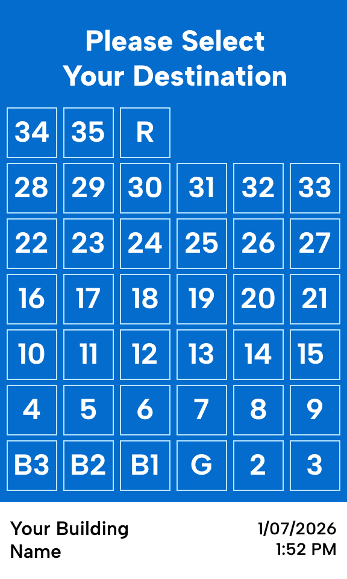
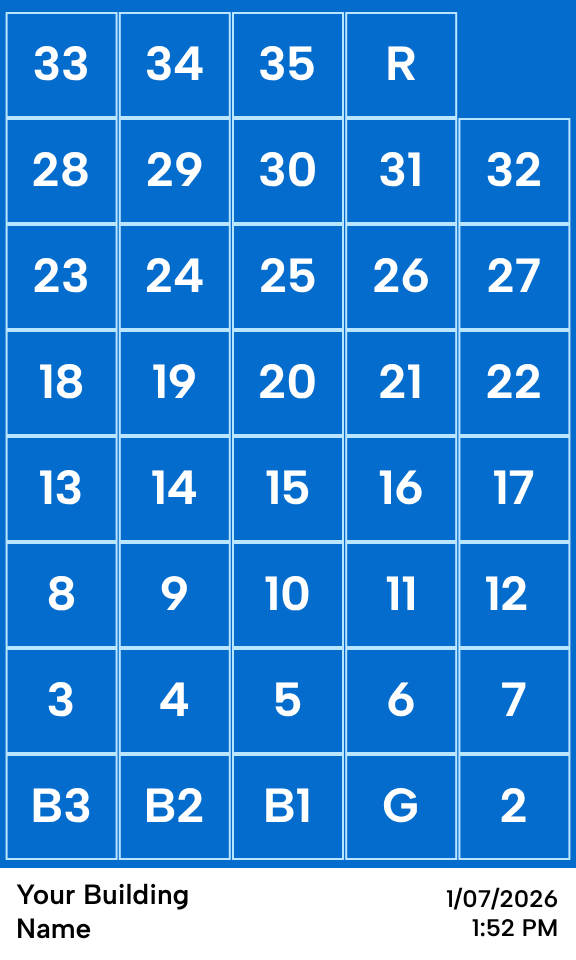
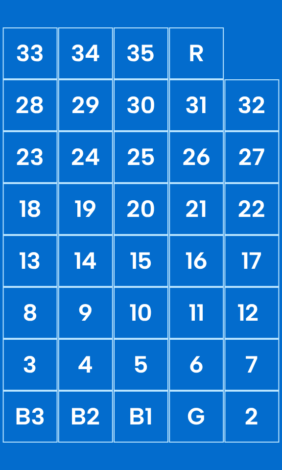
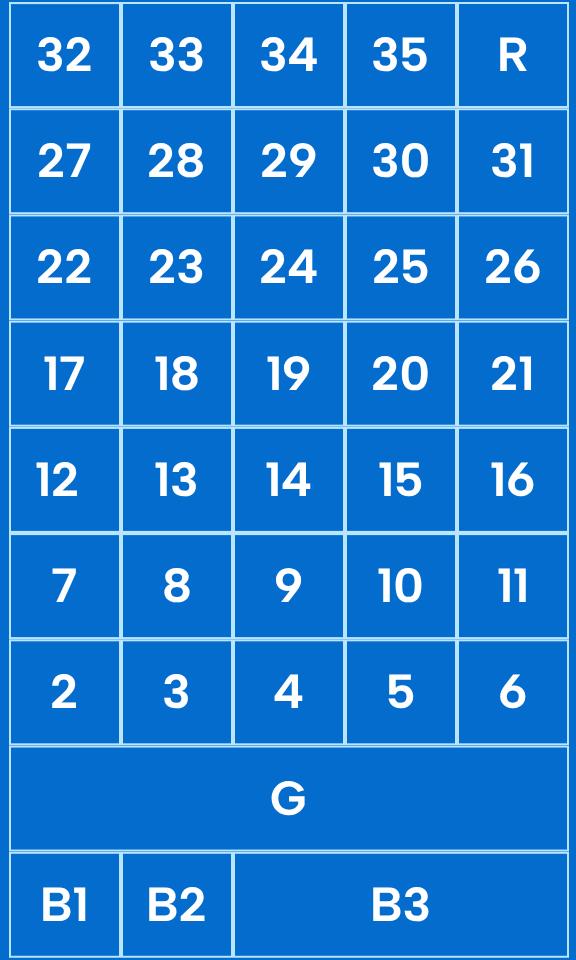

<!--toc:start-->
- [Intro - This Damned Thing](#intro-this-damned-thing)
- [Let's Improve It](#lets-improve-it)
  - [First: Who are our users?](#first-who-are-our-users)
  - [Tidying Up](#tidying-up)
  - [Adding Clarity](#adding-clarity)
  - [Reaching Ever Higher](#reaching-ever-higher)
- [Summary](#summary)
<!--toc:end-->

## Intro - This Damned Thing

In the apartment building where I live, I am forced to think about human design. Every. Single. Morning.

For context, I'm a non-disabled adult with decent dexterity when it comes to pushing buttons (something I've done my whole life).

Every morning, I wander out into my hallway with my dog in tow. Every morning, I steady myself, my shoulder buttressed against the wall, and I carefully choose the tiny letter **G** on my elevator's touchscreen panel... and, I pressed **7** again. Damn it.

<figure>
  
  <figcaption>A mock-up of an elevator's controls, rows and columns of small numbered buttons with a large heading that says "Please Select Your Destination". The glowing panel is 5″ x 3″(13 x 7.5cm) and sits vertically, displaying all the floors of the building, the name of the building and the date/time.
  </figcaption>
</figure>

  The above, seemingly crude rendering is near-perfect in likeness. You'll have to take my word for it.

## Let's Improve It

When refactoring a UI, it's important to start with the foundations. What are the user's goals? What here doesn't meet those needs? What are we even doing?

### First: Who are our users?

Let's state the users and goals explicitly.

#### Residents

Folks who live here are our primary users. They wake up here, they leave for work, they come back with groceries. They're young, they're old, they have kids or dogs. They're intimately familiar with the elevator, enough to a blog post about the UI...

They want to:
- get to their apartment
- reach their car in the basement garages
- visit the ground floor

#### Strangers

Delivery drivers, first-time visitors, me on move-in day. They aren't familiar with the building, this elevator, or perhaps elevators like it at all.

They want to:
- get to the right floor quickly
- get out of the building quickly

#### Shared Concerns

our users have many things in common. Their hands may be full, they may be confused or distracted. They could have motor skills impairments, temporarily or permanently.

This all boils down to two key needs at our floor selection screen: scannability and accuracy.

Let's get to it.

### Tidying Up

In both design and code, the art lies in deleting the right things.

Not one single user benefits from the "Please Select Your Destination" heading on this screen. It is the largest single piece of info present, and it is the most useless.

<figure>
  
  <figcaption>Our latest change removes the large header at the top. All of our buttons are a little bit larger, and there's less to visually parse. </figcaption>
</figure>

This single change frees up a ton of real estate. We can allocate that space to the core function of this panel, selecting a floor!

The elderly in our building have complained that the screen is hard to use. They've been dismissed for just being old or crabby about new technology. By my measurements, each button is about **0.5 inches (1.27cm)** in the real world. As a frame of reference, the ADA guidelines say that an elevator's *physical* buttons should be no smaller than 3/4" (1.9cm). [(reference)](https://www.access-board.gov/ada/guides/chapter-4-elevators-and-platform-lifts/#car-controls).

Our change brings these buttons roughly to 0.6 inches (1.57cm). Not ideal, but a world of difference! We've gone from quite difficult to press while moving to manageable.

Let's keep going!

### Adding Clarity

Except for infants without object permeance, if you are in my building then you know what building you're in. You also probably have a device in your pocket that tells time. I don't need the elevator selection screen to tell me this info. It serves only to distract, more noise to complicate the functionality. Deleted!

<figure>
  
  <figcaption>This iteration shows only actionable buttons. There's no ambiguity about where to focus.</figcaption>
</figure>

We're greeted with clarity. The eyes don't have to parse sections and rule out unnecessary info, it's been paired down to one singular goal: get you somewhere.

We've gained some vertical space back by removing unnecessary info, let's make good use of it.

### Reaching Ever Higher

**G** and **B3** are pressed more than any other button. General parking is on B3, and of course G is how you get to the world.

We can achieve a few goals with a new layout:

1. Provide visual weight to the most pressed buttons, making them easier to press
2. Introduce clarity through hierarchical placement, making it scannable

<figure>
  
  <figcaption>This final iteration shows a very wide "G" button stretching the width of the controls,  visually separating the higher and lower floors. The 3 basement buttons exist on their own line, below G. The upper floors are now instantly scannable. </figcaption>
</figure>

Instead of a sequential grid of buttons reading from the bottom-left to the top-right, we've made placement important. A quick glance matches our mental understanding of the building: **G** stands out, anchoring us in the space. 

## Summary

I am grasping at the minutiae of my daily life for a sense of control, a sense of purpose in a world where we're constantly being rug-pulled.

I'm an unemployed front-end expert with no control over this elevator's UI. There is no chance in hell this gets implemented.

But this exercise isn't futile. I am here, making my brain think about how to improve the world for everyone, and that's always worthwhile. The choices we make every day to improve the world around us have immeasurable compounding effects, no matter your station in life.

Be excellent to each other.
