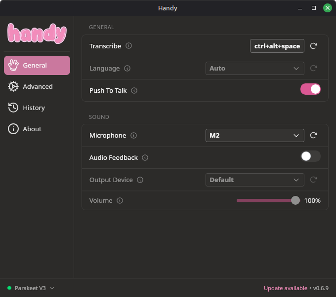

Speech-to-text seems like the most human, natural way to engage with written language. From day one, humans are trying to teach humans how to speak. Usage statistics show that teens prefer to write texts using speech-to-text, and that makes sense to me.

I often struggle to write in my natural voice in a first draft. Speaking achieves that naturally! So I'm setting out to write this blog post entirely with speech-to-text (though edited by hand.) How am I achieving that? Well, let's talk about [Handy](https://handy.computer).

There are many software solutions for speech-to-text, some dating back decades like Dragon NaturallySpeaking. So why Handy? Handy calls itself the free and open source app for speech-to-text. The four principles it lists on its website are

- it's free
- open source
- private
- and simple.

These all happen to be very important principles to me! In addition to those principles, it aims to be tiny and extensible. So how does it work?

## Installation / Setup

Handy is written using Tauri, a cross platform application framework and a personal interest of mine. It is distributed for Linux, Mac, and Windows.

I use Linux Mint, and so installation was straightforward for me: I simply downloaded the .deb file and installed it.

You're given a choice of Audio Speech Recognition (ASR) models to use on first run. For this blog post, I used the default suggested model of Parakeet v3.

> [!warning] A Note About ASR Models
> The morality of these models are outside the scope of this post. There are many intelligent people fighting an important fight against infringement and large-scale abuse and I stand with those people. This software aims to improve the lives of those who need it, and that's a worthwhile endeavor.

## Experience So Far

Handy started immediately and without issue. Handy works by activating a hotkey to begin transcription. Once activated, it listens. When you disengage the hotkey, it pastes the content into wherever your cursor is. This works great for me across many contexts.

I typically write my blog post in Markdown using Helix editor. The terminal usually complicates things, but in this instance it was very easy to change the shortcut commands for transcription (I personally use ctrl + alt + space.)

I was immediately impressed by Handy's capabilities. It succeeded in capturing most of my words as intended, and usually captured my inflection. End a sentence on a higher note? It knows that's a question. Want an exclamation point? That's a little harder. I found myself sounding like a comic book trying to achieve writing the indicated excitement. Wow! Pow! Whammy!

The portability of Handy was truly impressive. I've used it to write this blog post, to post to Mastodon, to write messages to my wife. Writing directly to wherever my cursor is means that I can use it in many places, unlike other solutions like Serenade that are more limited in scope.

## Limitations

Handy simply fails to transcribe symbols. It does not recognize them: it defaults to naturalized speech. "Ampersand" results in the word, achieving `/` by saying "slash" was impossible, and phrases like "v3" were transcribed as "v three", for instance.

This makes sense as these are generalized speech models, but it does limit use cases. Purpose-built solutions like Serenade allow you to code with your voice with some degree of accuracy, but bring complexity through a plugins-only system (it simply won't work without VS Code or friends) and lots of specific command overhead.

Additionally, Handy seemed to struggle with homonyms. On multiple occasions, it's confused "and" and "end". It's unclear if that's because of my speech / inflection, or a product of the model I'm using.

Lastly, there's human error. On multiple occasions, I forgot to enter Insert mode before using Handy, resulting in a bunch of random Helix command executions. That's on me though!

## Takeaways

Frankly, this blog post would never have happened without Handy. Not because it's the topic, but because it has lowered the barrier of entry for getting a first draft done. Local, secure, accessible transcription is a gift for someone like me with ADHD. On so many occasions I have felt thwarted because my hands can't keep up with my mind. Speech-to-text, regardless of the tool you use, can go a long way into alleviating that pain.

The barrier to done has been lowered significantly, and I'm excited to leverage it in the future.

I'd love to see the ability to insert symbols, and spell out necessary fragments like "https". Then it may fully live up to the goal of a general purpose accessibility tool!
